<div align="center">

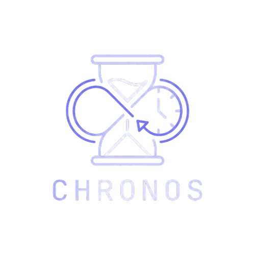

# CHRONOS
### The Flow State Operating System

[](https://laravel.com)
[](https://tailwindcss.com)
[](https://en.wikipedia.org/wiki/Flow_(psychology))
[](LICENSE)

<br />

<!-- 
  IMPORTANT: Ensure your folder is named 'screenshots' (lowercase) 
  and the file is named 'landing-hero.png'.
-->
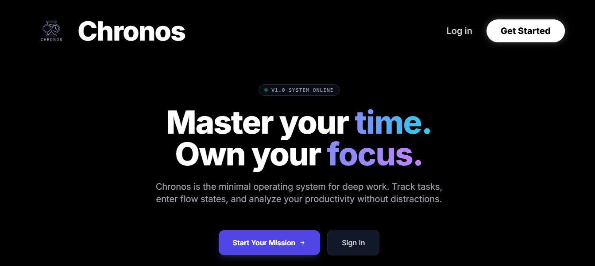

<p align="center">
  <b>Chronos is a minimal operating system designed for deep work.</b><br>
  It replaces standard to-do lists with "Missions" and "Protocols," respecting biological ultradian rhythms to maximize output without burnout.
</p>

</div>
---

## 🧠 The Methodology

Chronos is built on three core pillars: **Structure, Science, and Specificity.**

### 1. How it works
The system forces you to single-task. You define a protocol, set a time limit, and execute.
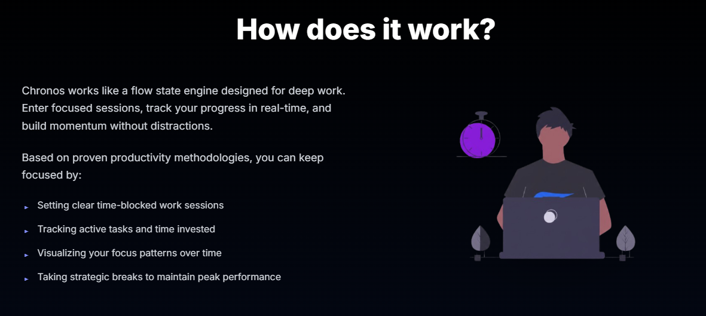

### 2. Who is this for?
Designed for engineers, academics, and creators who need to reclaim their attention span.
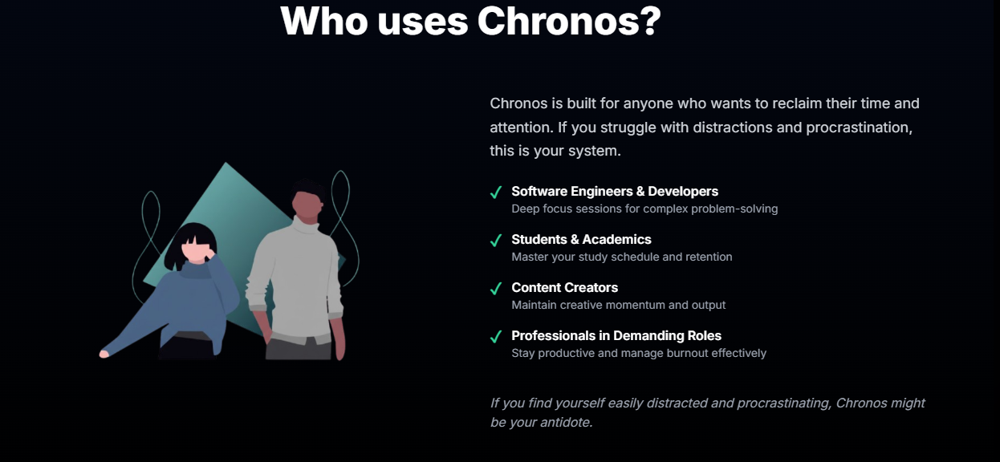

### 3. The Science
We utilize the 90-minute ultradian rhythm to ensure peak cognitive performance.
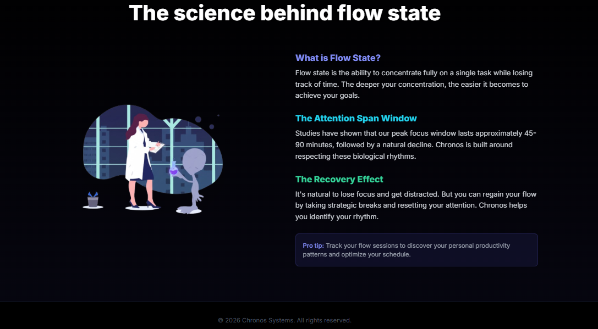

---

## 🔐 Access Control

Chronos uses a secure authentication system styled as a "System Initialization."

| **System Initialization (Register)** | **Pilot Authentication (Login)** |
|:---:|:---:|
| 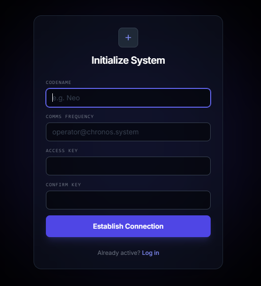 | 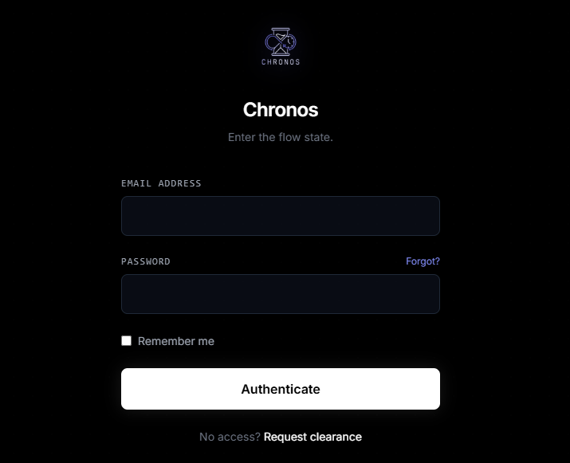 |

---

## 🎛️ Command Center (Workflow)

The Command Center is your distraction-free home base.

**1. Main Interface:** View your protocols and initialization status.
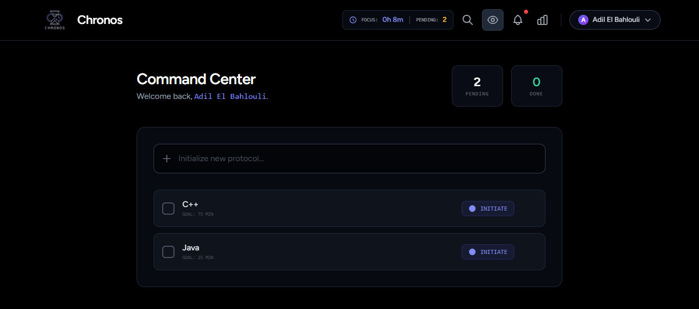

**2. Focus Mode Selection:** A streamlined view to jump immediately into action.
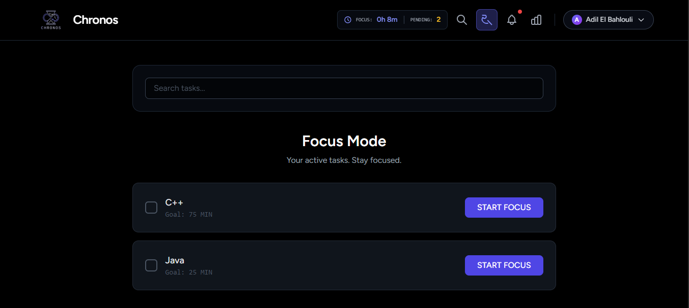

**3. Mission Completion:** Visual feedback when protocols are successfully terminated.
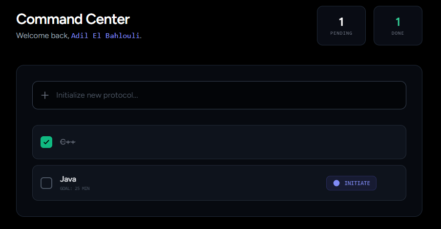

---

## ⚡ Execution Engine

When you begin a task, you enter the **Mission Briefing** and **Active Flow** stages.

### Mission Briefing
Set your parameters: Name, Duration, and Intelligence Notes.
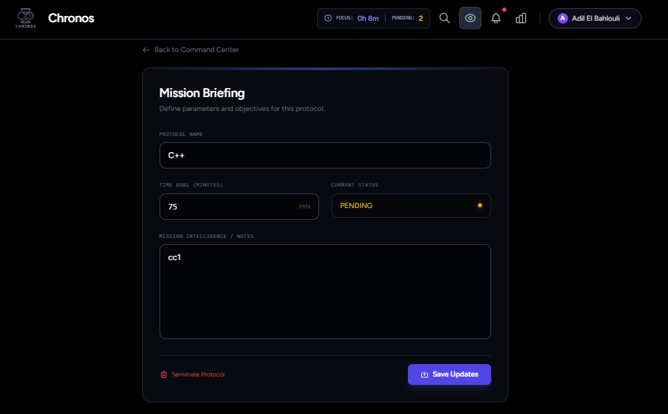

### Active Deep Work
The interface clears. Only the objective and the time remain.
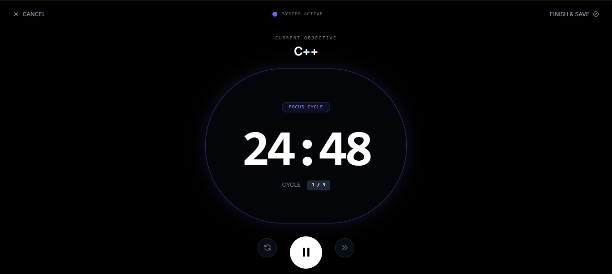


---

## 👤 Pilot Profile & Settings

Track your data and manage your credentials.

**1. Analytics:** Visualize your total focus time and completion percentages.
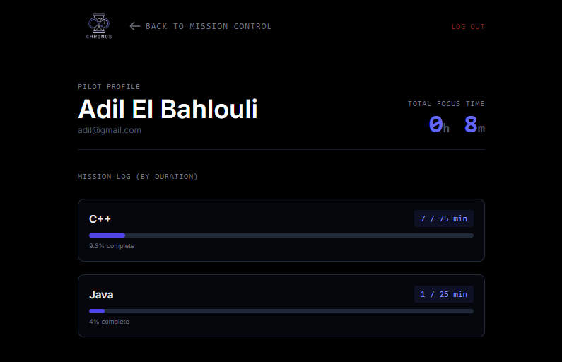

**2. System Menu & Settings:** Update your pilot profile, password, and system preferences.
| **Quick Menu** | **Account Settings** |
|:---:|:---:|
| 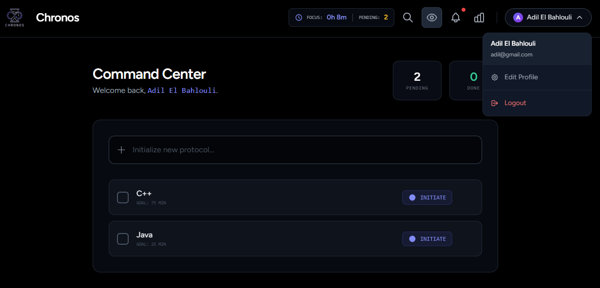 | 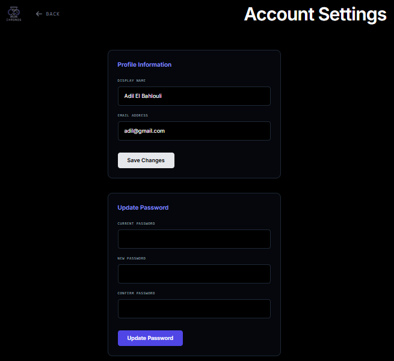 |

---

## 🚀 Installation

### Prerequisites
*   PHP 8.1+
*   Composer
*   Node.js & NPM
*   MySQL

### Setup Guide

1.  **Clone the Repository**
    ```bash
    git clone https://github.com/YOUR_USERNAME/chronos.git
    cd chronos
    ```

2.  **Install Dependencies**
    ```bash
    composer install
    npm install
    ```

3.  **Environment**
    ```bash
    cp .env.example .env
    php artisan key:generate
    ```
    *Configure your `.env` with your DB credentials.*

4.  **Database**
    ```bash
    php artisan migrate
    ```

5.  **Launch**
    ```bash
    php artisan serve
    npm run dev
    ```

---

## 👨‍💻 Contributors

**Created & Developed by:** Adil El Bahlouli

---

## 📄 License

This project is open-source and licensed under the [MIT License](LICENSE).
